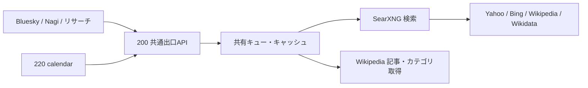

# 検索・Wikipediaの共通出口（2026-09-27）

本番は `192.168.1.200:8080` の共通APIだけを使う。SearXNG本体にはホストポートを
割り当てない。220側のSearXNGは廃止し、bot-tan-calenderも200へ接続する。



## APIと制御

- `GET /search?format=json&q=...`: SearXNG JSON API。既存の検索パラメータを受け付ける。
- `GET /wikipedia/ja?action=query&format=json&...`: Wikipediaの読取専用API。
  言語部分は `en` 等も可。記事本文、検索、カテゴリ一覧だけを許可する。任意URLは受け付けない。
- `GET /stats`: 呼び出し元別の件数、キャッシュ、共有、上流実行、混雑、429待機を確認する。
- `GET /healthz`: APIとSearXNGの疎通のみ。**検索の関連性を保証しない**。

healthz以外は `Authorization: Bearer <SEARXNG_API_KEY>` が必要。
クライアントの `X-Search-Source` は観測用で、キャッシュを分割しない。

検索とWikipedia取得を同じワーカーで直列化し、**完了から次の開始まで最低1秒**空ける。
同一URL（パラメータ順とqの前後空白を正規化）の進行中要求は共有する。
応答は最大256件・合計16MiBまでキャッシュする。検索は5分、Wikipedia記事は6時間、
エンジンの部分障害を含む検索応答は15秒に短縮する。
HTTPエラー、不正JSON、Wikipedia APIエラーは成功キャッシュへ入れない。

未完了の異なる要求は最大8件、キュー待ちは最大10秒、上流タイムアウトは15秒。
期限切れの仕事は上流へ送らず503とする。呼び出し側のタイムアウトは30秒にする。
HTTP待機スレッドも32本までに制限する。

429はRetry-After（最大1時間、指定なしは180秒）、SearXNG内のリクエスト過多や
Wikipediaのmaxlagは180秒、出口全体を休ませる。休止中もキャッシュは返せる。
新規の未キャッシュ要求は429になるため、呼び出し側は通常の取得失敗として扱い、
直接接続や即時再試行で迂回しない。待機中の要求も10秒を超えたら破棄する。

キュー・キャッシュ・休止状態は単一プロセスのメモリ内。**gatewayを複数台/複数プロセスで起動しない**。
再起動でこれらの状態は消える。上流429直後の再起動で制限を解除する運用は避ける。

## 接続設定

`searxng/.env`:

```dotenv
SEARXNG_SECRET=<SearXNGのsecret>
SEARCH_GATEWAY_API_KEY=<openssl rand -hex 32で生成>
SEARCH_GATEWAY_BIND=192.168.1.200
SEARXNG_PORT=8080
```

両PJの `.env`:

```dotenv
SEARXNG_BASE_URL=http://192.168.1.200:8080
SEARXNG_API_KEY=<上のSEARCH_GATEWAY_API_KEYと同じ値>
SEARXNG_ENGINES=yahoo,bing,wikipedia,wikidata
```

bsky側は `SEARXNG_TIMEOUT_MS=30000`、calendar側は `SEARXNG_TIMEOUT_S=30`。
LAN外へ公開しない。キーはログやコマンド引数へ出さない。
`scripts/deploy.sh` は毎回 `scripts/deploy-searxng.sh` を実行し、Git差分の有無にかかわらず
SearXNGの `latest` とgatewayのイメージをpullする。新イメージがあればComposeが更新する。
`searxng/` または更新スクリプトに差分があれば、bind mountの変更も反映するため再作成する。
変更がなければ稼働中コンテナを維持する。更新後はhealthcheckを待ち、版とimage IDを記録する。
pull失敗時は再作成せず、他appsのデプロイを続行した後、全体を非ゼロで終了する。
再試行は `bash scripts/deploy-searxng.sh --force-recreate` で行える。
これはデプロイ時の更新であり、デプロイが無い期間に自動更新するタイマーではない。

切り替え時はAPIと利用側を一緒に更新する。APIだけ先に認証必須化すると旧クライアントが401になる。
旧env・コミット・コンテナimage IDを控え、200側を先に更新、続いてcalendarを更新して疎通確認、
最後に220側の `nagi-searxng` の再起動ポリシーを無効化して停止する。
ロールバックもAPIと両クライアントの接続設定を一組で戻す。

## 検索量の整理

| 呼び出し元 | 処理 |
|---|---|
| grounding | 重複・空クエリを除去。最大4クエリを順番に依頼し、一度にキューを占有しない |
| knowledge-card | 対象名の1検索 |
| Nagiラジオ | 確認済みAnimeThemes出典があれば0検索。それ以外は背景調査を最大2検索 |
| Nagi候補選定 | 曲リンク不成立のみ再選定。背景が見つからないだけでは別の曲を引き直さない |
| 題材選曲 / キャラ調査 | 共通APIへ依頼し、横断キャッシュと進行中要求の共有を利用 |
| 本文取得 | Wikipedia記事は共通APIへ。それ以外は従来のSSRF検証付き本文取得 |
| calendar | SearXNGとWikiClientの両方を共通APIへ。独自のsleep/ロック/記事キャッシュは撤去 |

これまではNagiラジオの背景調査が4クエリ×3候補で最大12検索だった。
`engines=...` と `categories=general` の併記はSearXNGの実装上、カテゴリ全体を
追加検索する。gatewayでこの併記を解消し、エンジンを絞ったプローブも正しく送信先を限定する。

## Bing調査の結論と限界

9月2日の記録では一覧・時事検索は正常。200側はその日に作成したコンテナのままで、
9月27日の調査ではBingの検索語無視/無関係な結果を確認した。

- `MINMI Who's Theme`: 歌手の一般情報だけ、またはGoogle Maps等の無関係な結果。
- `ROOKiEZ is PUNK'D IN MY WORLD`: Windows、Netflix等の無関係な結果。
- `米津玄師 Lemon`: 曲を絞れず歌手の一般情報が上位。
- 一方「秋アニメ」の一覧検索とWikidataの「初音ミク」の要約は機能した。

本番コンテナ内でBingへ直接問い合わせ、HTMLの検索欄にはクエリ全文が存在し、
検索結果のh2は既に無関係だった。SearXNGの解析結果はそのh2と一致した。
したがって、今回の再現はアプリでのクエリ欠落やSearXNGのタイトル抽出ミスではない。

上流には同症状の [issue #4964](https://github.com/searxng/searxng/issues/4964) と、
9月11日にマージされた [修正 #6671](https://github.com/searxng/searxng/pull/6671) がある。
旧mkt指定と修正版のsetlang/cc指定を2秒以上空けて比較しても、本番回線では改善しなかった。
さらに220側の検証用 `2026.9.25-12f8b6515` でも同じ曲検索の異常を再現した。
220側の既存SearXNGも9月22日版だったため、200側の版の古さだけでは説明できない。

9月27日、本番の共通API経由で更新後の `2026.9.25-12f8b6515` を再検証した。
`MINMI Who's Theme` は四工大の進学記事、`ROOKiEZ is PUNK'D IN MY WORLD` は
別人の成人向けページが上位に出た。言語を英語に変え、曲名を引用符で囲み、作品名を
追加しても、ホテルやGoogle Maps等の無関係な結果になった。いずれもHTTP 200で
`unresponsive_engines` は空なので、応答の成否や件数だけでは異常を検知できない。
一方、同じ出口・同じエンジンで `秋アニメ 2026` はアニメ一覧5件、
`薬屋のひとりごと` は公式サイトやWikipedia記事を返した。

WikipediaのSearXNGエンジンは作品名の要約には有効だが、`秋アニメ 2026` では
結果も要約も0件。共通APIのWikipedia検索 (`/wikipedia/ja`, `list=search`) では
`IN MY WORLD` 等の関連項目を見つけられるが、秋アニメの一覧は得られなかった。
したがってBingを全経路から外してWikipediaだけにすると、今期作品などの一覧調査が
退行する。Bingは一覧・作品名には当面残し、曲の背景調査はBing結果の関連性を
検証して採用する。曲名検索の解決を要する場合はWikipedia検索APIを経由して
出典のある記事だけ使う方針とし、単に検索回数を増やす対応はしない。

**頻度制御や最新版への更新だけでBingが復旧したとは扱わない。**
Bing側の地域・接続元・応答制御のどれが原因かまでは未確定。
背景情報が無いときに捏造したり検索回数を増やしたりせず、出典のある素材だけを利用する。
`pnpm searxng:probe -- --query="MINMI Who's Theme"` 等で件数に加えてタイトルと本文の関連性を見る。

## 10月7日の再調査: Yahooを主索引にする

本番のSearXNGは `2026.10.4-d48c4b555`。本番回線から、本番コンテナとは別の使い捨て
コンテナで各エンジンを個別に確認した（クエリ間3秒）。

| エンジン | 結果 | 上流issue |
|---|---|---|
| yahoo | ✅ 6クエリ全てで関連結果（7件）。曲名も一覧も取れる | — |
| bing | △ `ROOKiEZ is PUNK'D IN MY WORLD` は早稲田大学の質問、`技術書典` は韓国ドラマの記事。他4件は正常 | [#4964](https://github.com/searxng/searxng/issues/4964)（修正済みとされる） |
| duckduckgo | △ `秋アニメ 2026` でCAPTCHA。他は結果あり | [#6779](https://github.com/searxng/searxng/issues/6779)、[#6596](https://github.com/searxng/searxng/issues/6596) |
| brave | ❌ 初回から too many requests | [#6819](https://github.com/searxng/searxng/issues/6819) |
| google | ❌ access denied | — |
| qwant | ❌ 全クエリCAPTCHA | [#3929](https://github.com/searxng/searxng/issues/3929)、[#6358](https://github.com/searxng/searxng/issues/6358) |
| startpage / mojeek / presearch | 未確定（設定で有効化しても読み込まれず、`engines=` 指定が無視された） | startpageは [#6520](https://github.com/searxng/searxng/issues/6520) |

Braveは#6819で、IPブロックではなく `brave.py` が付ける `Accept-Encoding: gzip, deflate` と
curl_cffiのChrome偽装の組み合わせで429になる、という分析がある。上流の修正後に再評価する。

**`engines=` に読み込まれていないエンジン名だけを指定すると、SearXNGはエラーにせず
既定エンジンの結果を返す。** エンジンを絞って測るときは、件数ではなく各結果の
`engine` / `engines` を見ること。

Yahooを足すだけでは、Bingの無関係な1位が上位5件に残った。SearXNGのスコアは
エンジンの `weight ÷ 順位` の和なので、`settings.yml` でYahooを `weight: 10` にした。
Yahooの7位（10/7）もBingの1位（1）より上になり、Bingは補完に回る。
同じ6クエリで上位6件から無関係な結果が消えた。レイテンシはBing単独の約0.9〜1.6秒に対し、
併用でも約0.8〜1.3秒で増えなかった（エンジンは並列に問い合わせる）。

YahooもBingの索引を使うので、索引の多様化ではない。Bingの取得・解析経路の異常を
迂回できる冗長化として扱う。Yahooが詰まった場合はBingの結果だけが残るので、
引き続き件数ではなく関連性で監視する。

クライアントは `engines=` を明示して送るため、`SEARXNG_ENGINES` を設定している環境は
`yahoo` を足さないと反映されない（本番の `.env` とcalendar側も同様）。

## 検証

```sh
python3 -B -m unittest discover -s searxng -p 'test_*.py' -v
```

独立したクライアントプロセスからの検索/Wikipedia混在リクエストで実時間の1秒間隔を確認する。
キャッシュ、進行中共有、期限切れ破棄、上限、429、認証、許可先の限定もテストする。
